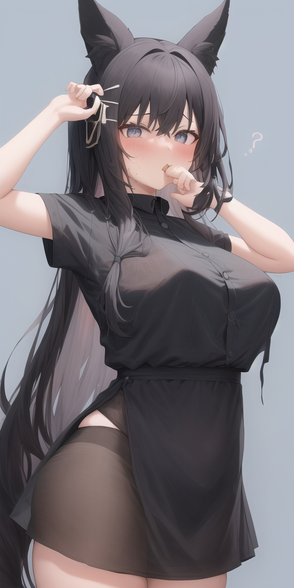
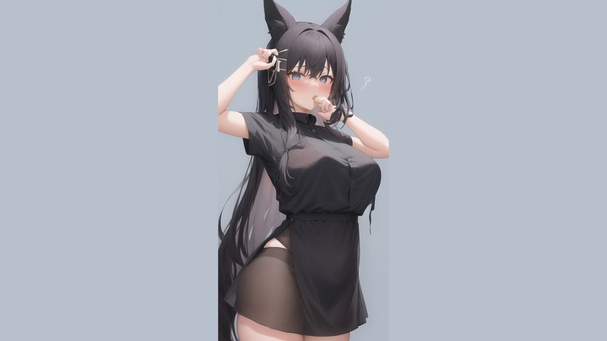

# pc-sakan
pc-sakanは縦長の壁紙画像をPC背景として使えるように加工します！

加工は、元画像の左右に単色の背景を追加することで行います。

## Environment
- Python 3.x
- opencv
- numpy
- statistics
## Usage
`python3 main.py image_file_name`

出力は「image_file_name_desktop.png」となります。

左の画像が右の画像のようになります。

画像は16:9で生成されます。背景色は元の画像の中で一番使われている色が採用されるので、背景が単色の画像だときれいに生成出来ます。

